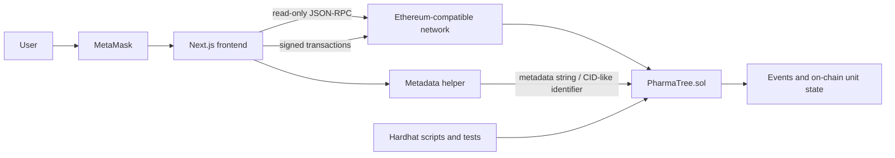
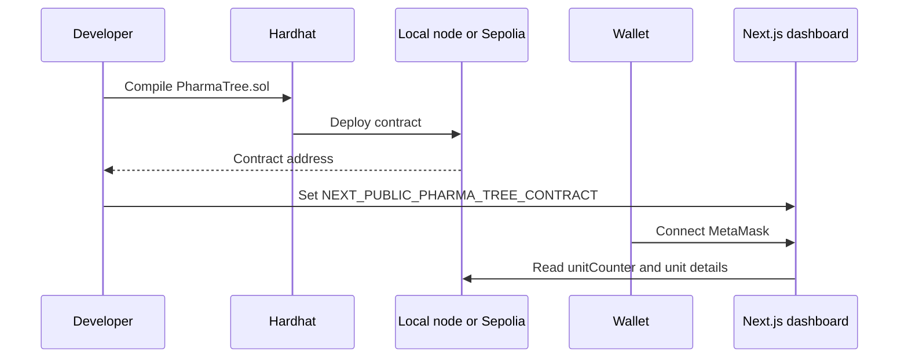
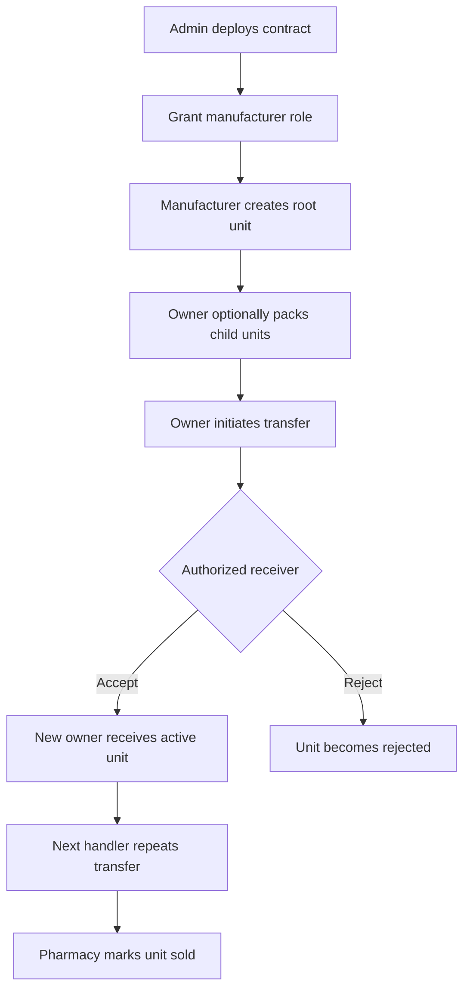

# PharmaTree project documentation

## 1. Project purpose

PharmaTree is a blockchain-backed pharmaceutical supply-chain application. It
creates a tamper-evident record for a medicine unit and tracks that unit as it
moves between authorized participants such as a manufacturer, distributor, and
pharmacy.

The application uses a hierarchical model:

```text
Container
└── Shipment
    └── Batch
        └── Box
            └── Individual item
```

The hierarchy is represented by `parentId`, `rootId`, and the contract's
`children` mapping. Every unit has an owner, manufacturer, status, quantity,
and metadata string.

## 2. Architecture



### Main components

| Component | Location | Responsibility |
| --- | --- | --- |
| Smart contract | `backend/contracts/PharmaTree.sol` | Roles, unit hierarchy, ownership, transfers, and sale state |
| Hardhat project | `backend/` | Compile, deploy, test, and run verification scripts |
| Dashboard | `frontend/src/` | Wallet connection, contract reads, transaction forms, and views |
| Contract client | `frontend/src/lib/pharmaTree.ts` | ABI, contract address, enum labels, and event definitions |
| Metadata helper | `frontend/src/lib/ipfs.ts` | Builds medicine metadata and a CID-like identifier |

## 3. User-facing features

### Overview

The overview page reads all units from the contract and summarizes units visible
to the connected wallet, including active, pending, and sold counts.

### Create medicine

The create view validates a connected wallet and manufacturer/admin permission,
then calls:

```text
createRootUnit(Container, "<medicine name>, <tablet count> tablets")
```

The transaction creates the first unit in a product tree. The deployer is the
initial admin and manufacturer.

### Admin and role management

An admin can grant:

- `MANUFACTURER_ROLE` to wallets that create root units
- `HANDLER_ROLE` to wallets that receive and handle units

The dashboard exposes role assignment. The contract also has removal methods;
the current dashboard focuses on granting roles.

### Transfers

Transfers use a two-party handshake so the sender cannot silently change
ownership:

1. Current owner calls `initiateTransfer(unitId, receiver)`.
2. Receiver must be an authorized manufacturer or handler.
3. The unit becomes `PendingTransfer`.
4. The selected receiver calls `acceptTransfer(unitId)`.
5. Ownership changes and the unit returns to `Active`.

The pending receiver may instead call `rejectTransfer`. The contract currently
sets the status to `Rejected` when a pending transfer is rejected; this is an
important behavior for clients to account for.

### Inventory and sale

Inventory displays unit details such as hierarchy, level, owner, pending
receiver, status, quantity, and metadata. The current owner can call
`markAsSold(unitId)`, which changes the unit to `Sold` and prevents later
transfers.

## 4. End-to-end workflows

### Initial setup workflow



### Medicine traceability workflow



### Read and write behavior

1. The frontend creates a read-only `ethers.JsonRpcProvider` using
   `NEXT_PUBLIC_RPC_URL`.
2. It reads `unitCounter`, then loads each unit with
   `getUnitDetails`.
3. When MetaMask is connected, the frontend creates an
   `ethers.BrowserProvider` and signer-bound contract.
4. User actions submit signed transactions.
5. The UI waits for transaction confirmation and reloads unit data.

## 5. Smart-contract model

### Roles

| Role | Capabilities |
| --- | --- |
| Admin | Grant/revoke manufacturer and handler roles |
| Manufacturer | Create root units; may transfer and accept/reject transfers |
| Handler | Receive, transfer, accept, or reject units |
| Current owner | Pack children, initiate transfer, and mark a unit sold |

The constructor grants the deployer admin and manufacturer access.

### Unit levels

The Solidity enum order is part of the frontend ABI contract:

| Numeric value | Level |
| ---: | --- |
| 0 | Container |
| 1 | Shipment |
| 2 | Batch |
| 3 | Box |
| 4 | IndividualItem |

### Statuses

| Numeric value | Status | Meaning |
| ---: | --- | --- |
| 0 | Active | Available for normal ownership operations |
| 1 | PendingTransfer | Transfer initiated; waiting for receiver |
| 2 | Sold | Finalized and no longer transferable |
| 3 | Rejected | Status label reserved by the contract/frontend mapping |

## 6. Technology stack

### Frontend

- Next.js `16.3.1` with the App Router
- React `19`
- TypeScript
- `ethers.js v6`
- MetaMask browser provider for signed transactions
- CSS modules and global CSS for dashboard styling

Routes are thin wrappers around the reusable `PharmaWalletView` component:

| Route | View |
| --- | --- |
| `/` | Overview |
| `/create` | Create medicine |
| `/admin` | Role administration |
| `/transfers` | Transfer actions |
| `/inventory` | Unit inventory |

### Backend and blockchain

- Solidity `0.8.20`
- Hardhat `2.x`
- Ethers `6.x`
- OpenZeppelin `AccessControl`
- Chai/Mocha tests through Hardhat Toolbox
- Local Hardhat node or Sepolia testnet

## 7. Configuration

### Backend `.env`

Copy `backend/.env.example` to `backend/.env` and configure:

- `RPC_URL` and `PRIVATE_KEY` for local development
- `SEPOLIA_RPC_URL` and `SEPOLIA_PRIVATE_KEY_MANUFACTURER` for Sepolia
- optional distributor key/address for multi-wallet verification
- `SEPOLIA_CONTRACT_ADDRESS` after deployment
- `ETHERSCAN_API_KEY` if contract verification is required

### Frontend `.env.local`

Copy `frontend/.env.example` to `frontend/.env.local`:

```dotenv
NEXT_PUBLIC_RPC_URL=http://127.0.0.1:8545
NEXT_PUBLIC_PHARMA_TREE_CONTRACT=0xYOUR_DEPLOYED_CONTRACT_ADDRESS
```

The frontend address must match the network selected in MetaMask.

## 8. Development and verification

```bash
# backend
cd backend
npm install
npm run compile
npm test
npm run node

# in another terminal, after the node is running
npm run deploy

# frontend
cd ../frontend
npm install
npm run dev
npm run lint
npm run build
```

For Sepolia, configure the backend environment and run:

```bash
cd backend
npm run deploy:sepolia
npm run verify:sepolia-two-wallet
```

The two-wallet verification script grants roles, creates a root unit, initiates
a manufacturer-to-distributor transfer, accepts it from the distributor wallet,
and prints the final state.

## 9. Current limitations and next improvements

- `frontend/src/lib/ipfs.ts` currently builds a deterministic CID-like string
  locally. It does not upload data to Pinata/IPFS yet, even though Pinata
  packages and environment placeholders exist.
- The dashboard currently stores simple metadata directly in the contract for
  the create flow instead of calling the metadata helper.
- Unit loading performs one read per unit. An indexed event/subgraph or a
  contract pagination strategy would scale better for large inventories.
- The frontend uses the first configured contract address and requires manual
  network/address configuration.
- Admin role removal and a dedicated admin-only route are not fully exposed in
  the dashboard.
- Private keys must stay in local environment files and must never be committed.
