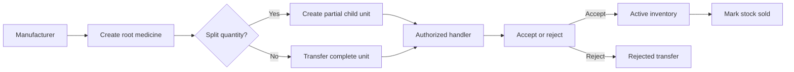
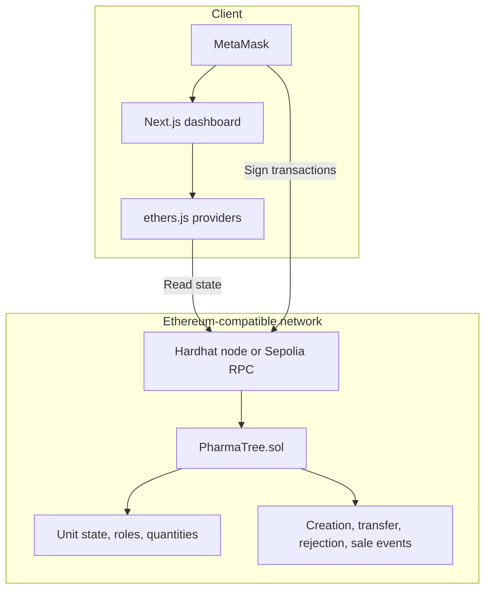

# PharmaTree

## Blockchain-based pharmaceutical supply-chain verification

[](LICENSE)
[](https://nextjs.org/)
[](https://soliditylang.org/)
[](https://ethereum.org/)
[](https://github.com/ayonm95)

> **From container to pill, PharmaTree makes pharmaceutical provenance
> inspectable, quantity-aware, and difficult to counterfeit.**

PharmaTree is an Ethereum-compatible pharmaceutical supply-chain dashboard. It
tracks medicine creation, ownership, authorized transfers, partial quantities,
hierarchical lineage, inventory, and final sale through a Solidity smart
contract and a Next.js interface connected with MetaMask.

## Contents

- [Why PharmaTree](#why-pharmatree)
- [How it works](#how-it-works)
- [Product capabilities](#product-capabilities)
- [Architecture](#architecture)
- [Repository layout](#repository-layout)
- [Quick start](#quick-start)
- [Sepolia deployment](#sepolia-deployment)
- [Validation](#validation)
- [Environment variables](#environment-variables)
- [Security](#security)
- [Documentation](#documentation)
- [Author and license](#author-and-license)

## Why PharmaTree

Pharmaceutical supply chains are not just about moving a product—they are about
preserving a trustworthy chain of custody. PharmaTree combines:

| Supply-chain need | PharmaTree approach |
| --- | --- |
| Provenance | Every unit is represented by on-chain state and events |
| Hierarchy | Container → Shipment → Batch → Box → Individual item |
| Quantity accuracy | Partial transfers preserve sender remainder and receiver quantity |
| Ownership safety | Two-party transfer acceptance prevents silent handoffs |
| Counterfeit resistance | Authorized roles and immutable transfer history |
| Operational clarity | Manufacturer lineage views and handler-local inventory views |

## How it works



Each transfer is a handshake:

1. The current owner starts a transfer.
2. The contract checks the receiver's authorization.
3. The receiver accepts or rejects the pending unit.
4. The contract records the resulting ownership and status.

For a partial transfer, the sender keeps the remainder and the transferred
quantity becomes a child unit. Manufacturer views preserve lineage labels such
as `1.1`; handler views use wallet-local numbering such as `1` and `2`.

## Product capabilities

### Dashboard

- Overview of active, pending, sold, and visible units.
- Recent activity derived from contract events.
- Manufacturer-created medicines separated from handler inventory.

### Medicine creation

- Manufacturer/admin-only root-unit creation.
- Metadata and positive whole-number quantity validation.
- Container, Shipment, Batch, Box, and IndividualItem levels.

### Transfers

- Full and partial quantity transfers.
- Receiver role and wallet validation.
- Accept/reject workflow with pending state.
- Parent/root lineage preserved across partitions.

### Inventory and sale

- Current owner, quantity, status, metadata, and lineage visibility.
- Over-quantity transfer and sale validation.
- Whole-unit sale operation with transfer prevention after sale.

### Administration

- Admin-controlled manufacturer and handler role assignment.
- Role-aware navigation and dashboard actions.

## Architecture



### Contract model

| Role | Main capabilities |
| --- | --- |
| Admin | Grant/remove manufacturer and handler roles |
| Manufacturer | Create root units and participate in transfers |
| Handler | Receive, transfer, accept, and reject units |
| Current owner | Initiate transfers, create permitted children, sell stock |

### Status model

| Value | Status | Meaning |
| ---: | --- | --- |
| 0 | `Active` | Available for normal ownership operations |
| 1 | `PendingTransfer` | Waiting for the selected receiver |
| 2 | `Sold` | Finalized and no longer transferable |
| 3 | `Rejected` | Pending transfer was rejected |

## Repository layout

```text
contracts/PharmaTree.sol       Smart contract
scripts/                       Deployment and verification scripts
test/PharmaTree.test.ts        Hardhat regression tests
src/app/                       Next.js routes
src/components/                Dashboard UI and wallet workflows
src/lib/pharmaTree.ts          Contract ABI and enum mappings
src/lib/ipfs.ts                Metadata formatting helper
public/                        Static frontend assets
PROJECT_DOCUMENTATION.md       Detailed architecture and workflow reference
```

This is intentionally a single root project. There are no separate
`frontend/` or `backend/` folders.

## Quick start

### Requirements

- Node.js 18+
- npm
- MetaMask
- Optional: Sepolia RPC endpoint and funded test wallet

### 1. Install and verify the project

```bash
npm install
npm run compile
npm test
npm run lint
npm run build
```

### 2. Start a local blockchain

In terminal one:

```bash
npm run node
```

Hardhat prints funded development accounts. Import one into MetaMask and add
the local network:

```text
RPC URL:  http://127.0.0.1:8545
Chain ID: 31337
```

### 3. Deploy PharmaTree locally

In terminal two:

```bash
npx hardhat run scripts/deploy.ts --network localhost
```

Copy the printed contract address into `.env.local.example`, save it as
`.env.local`, and start the dashboard:

```bash
cp .env.local.example .env.local
npm run dev
```

Open <http://localhost:3000> and connect the imported MetaMask account.

## Sepolia deployment

Create the local deployment configuration:

```bash
cp .env.example .env
```

Set `SEPOLIA_RPC_URL`, `SEPOLIA_PRIVATE_KEY_MANUFACTURER`, and the other
required values in `.env`. Then use the available workflows:

```bash
npm run deploy:sepolia
npm run deploy:fresh-manufacturer
npm run verify:sepolia
npm run verify:sepolia-two-wallet
```

The fresh manufacturer workflow deploys a new contract, assigns the
manufacturer role, and updates the local contract address/deployment block
configuration. Use a dedicated Sepolia test wallet with no real funds.

## Validation

### Automated checks

```bash
npm run compile
npm test
npm run lint
npm run build
```

The 15-contract-test suite covers:

- Admin and role authorization.
- Root and child unit creation.
- Partial quantity transfers.
- Parent/child packing authorization.
- Transfer acceptance and rejection.
- Ownership changes.
- Sale detachment and transfer prevention.

### Manual smoke test

1. Connect a manufacturer wallet.
2. Create medicine and confirm it appears in Overview and Inventory.
3. Grant a handler role.
4. Transfer a full quantity and accept it from the handler wallet.
5. Transfer a partial quantity and verify the sender remainder.
6. Confirm handler inventory keeps separate local unit numbers.
7. Try an unauthorized receiver and an over-quantity transfer.
8. Mark active stock sold and confirm it cannot be transferred afterward.

## Environment variables

`.env.example` contains Hardhat and deployment values. `.env.local.example`
contains browser configuration:

```dotenv
NEXT_PUBLIC_RPC_URL=http://127.0.0.1:8545
NEXT_PUBLIC_CHAIN_ID=31337
NEXT_PUBLIC_PHARMA_TREE_CONTRACT=0xYOUR_DEPLOYED_CONTRACT_ADDRESS
NEXT_PUBLIC_DEPLOYMENT_BLOCK=
NEXT_PUBLIC_PINATA_API_KEY=
NEXT_PUBLIC_PINATA_SECRET_API_KEY=
```

For Sepolia, use chain ID `11155111` and the deployed Sepolia contract address.
Only placeholder templates belong in Git.

## Security

- Never commit `.env`, `.env.local`, private keys, RPC project IDs, or API keys.
- Use a dedicated test wallet for local and Sepolia automation.
- Keep Pinata credentials out of browser-exposed production configuration.
- Review transaction network and receiver address before confirming in MetaMask.
- Rotate any credential that may have been exposed.

## Documentation

See [`PROJECT_DOCUMENTATION.md`](PROJECT_DOCUMENTATION.md) for the full
architecture, smart-contract model, workflow diagrams, configuration reference,
known limitations, and release guidance.

## Author and license

**Ayon Moitra**

- GitHub: [@ayonm95](https://github.com/ayonm95)
- Repository: [blockchain-pharmaceutical-tracking](https://github.com/ayonm95/blockchain-pharmaceutical-tracking)
- Issues: [GitHub Issues](https://github.com/ayonm95/blockchain-pharmaceutical-tracking/issues)
- LinkedIn: [Ayon Moitra](https://www.linkedin.com/in/ayon-moitra-80b583320/)

Distributed under the [MIT License](LICENSE).
